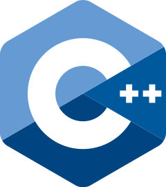

<Hero slots="image, heading, text1"/>

# C++ Whitepapers

Our library of C++ whitepapers, providing insights, methodologies, and advanced techniques

## Featured

<TextBlock slots="image, heading, text, links" width="33%" />

#### Memory safety and C++ successors

Software exploits increasingly harm consumers and threaten national security.
Memory safe programming languages provide substantial protection and some groups
are calling for legislation incentivizing their adoption. Unfortunately, it
isn't clear how companies with large existing C++ codebases can adapt. In an
effort to help answer that question, this paper explores the adoption
feasibility of several memory safe alternatives to C++. - *David Sankel* - May
22, 2023

[View Whitepaper](./cpp-successor-update/)

<TextBlock slots="image, heading, text, links" width="33%" />

#### Safety in the context of C++

Safety, particularly _memory safety_, is a growing concern in the C++ community
driven by the security implications of memory unsafe systems. Consumer Reports
states, "Roughly 60 to 70 percent of browser and kernel vulnerabilities, and
security bugs found in C/C++ code bases, are due to memory unsafety.". A recent
NSA report states, "...the overarching software community across the private
sector, academia, and the U.S. Government have begun initiatives to drive the
software development culture towards utilizing memory safe languages." The White
House National Cybersecurity Strategy plans to hold companies responsible for
retained data and increase liability for insecure software. Memory safety is
also called out. "In partnership with the private sector and the open-source
software community, the Federal Government will also continue to invest in
developing secure software, including memory-safe languages and software
development techniques, frameworks, and testing tools." This document defines
_safety_ and related terms to provide a framework to further the discussion with
actionable guidance regarding the correct use of C++.- *Sean Parent* - May 20,
2023

[View Whitepaper](./cpp-successor-update/)

<TextBlock slots="image, heading, text, links" width="33%" />

#### Defining Object, Validity, State, and Value

This document introduces a vocabulary and conceptual framework for dealing with
objects and validity in C++. We begin by exploring the limitations of existing
models and relevant examples. We proceed by introducing the meaning of validity,
object, state, and value. Finally, we define "meaningless" and demonstrate
its harmony with existing practice and desires. We discuss the implications of
this model for move semantics, correctness, and efficiency. - *David Sankel* -
May 19, 2023

[View Whitepaper](./cpp-successor-update/)

## 2023

### [Memory safety and C++ successors](./cpp-successor-update/)

Software exploits increasingly harm consumers and threaten national security.
Memory safe programming languages provide substantial protection and some groups
are calling for legislation incentivizing their adoption. Unfortunately, it
isn't clear how companies with large existing C++ codebases can adapt. In an
effort to help answer that question, this paper explores the adoption
feasibility of several memory safe alternatives to C++.  
*David Sankel* &mdash; May 22, 2023

### [Safety in the context of C++](./cpp-successor-update/)

Safety, particularly _memory safety_, is a growing concern in the C++ community
driven by the security implications of memory unsafe systems. Consumer Reports
states, "Roughly 60 to 70 percent of browser and kernel vulnerabilities, and
security bugs found in C/C++ code bases, are due to memory unsafety.". A recent
NSA report states, "...the overarching software community across the private
sector, academia, and the U.S. Government have begun initiatives to drive the
software development culture towards utilizing memory safe languages." The White
House National Cybersecurity Strategy plans to hold companies responsible for
retained data and increase liability for insecure software. Memory safety is
also called out. "In partnership with the private sector and the open-source
software community, the Federal Government will also continue to invest in
developing secure software, including memory-safe languages and software
development techniques, frameworks, and testing tools." This document defines
_safety_ and related terms to provide a framework to further the discussion with
actionable guidance regarding the correct use of C++.  
*Sean Parent* &mdash; May 20, 2023

### [Defining Object, Validity, State, and Value](./cpp-successor-update)

This document introduces a vocabulary and conceptual framework for dealing with
objects and validity in C++. We begin by exploring the limitations of existing
models and relevant examples. We proceed by introducing the meaning of validity,
object, state, and value. Finally, we define "meaningless" and demonstrate
its harmony with existing practice and desires. We discuss the implications of
this model for move semantics, correctness, and efficiency.  
*David Sankel* &mdash; May 19, 2023
